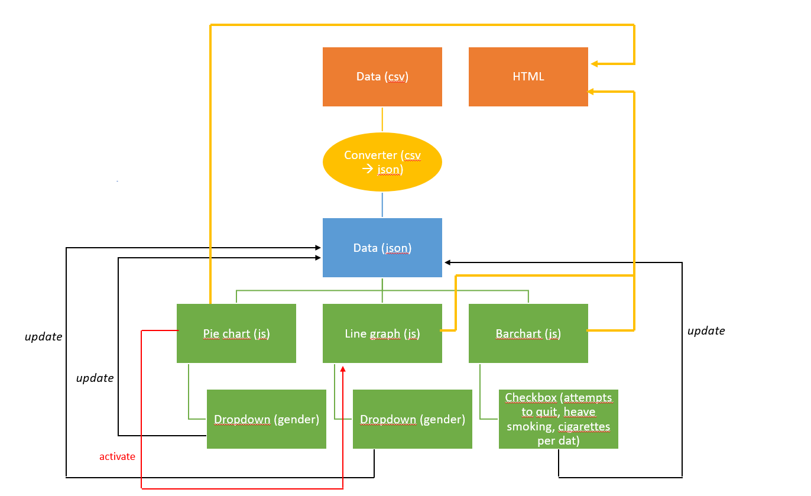

# Design Document
### Ewa Sillem, 12149071

#### Data sources
1. https://opendata.cbs.nl/statline/#/CBS/nl/dataset/83021NED/table?dl=F05B

2. https://www.volksgezondheidenzorg.info/onderwerp/roken/cijfers-context/trends

#### Technicam components

It is possible to download both datasets as a csv-file. Dataset 1 can be filtered on the website, before downloading it as a csv-file. This makes the downloaded csv-file easier to work with. Dataset 2 does not need to be filtered before downloading. It can also be downloaded as a csv-file.

Both datasets will be transformed into a json-file. This will be done in Python with pandas. Once both datasets are available as a json-file

The diagram below shows how the different components of the code for the data visualizations interact together.

First, the data is downloaded as a csv-file. The next step in the diagram is the converter. This is a python file which uses pandas in order to convert the csv-files to json-files. Once the data is present in json format, the data can be used to write the code for the pie chart, line graph and bar chart in JavaScript.

The pie chart code will also include the code for a dropdown menu. This will make it possible for the user to switch the dataset of the 'smoker/non-smoker' pie chart to men, women or both.

The code for the line graph will also include code for a dropdown menu. Similar to the dropdown menu in the pie chart, it will make it possible to switch between datasets for men, women or both, though this dropdown menu will have an effect on the lines shown in the line graph.

A checkbox will be included in the code for bar chart. The checkbox will have 3 options. Each option represents a characteristic that is represented as a bar in a certain color in the bar chart. Checking a box will lead to the addition or removal of the specific bar in the bar chart.

All the javascript code will be called in a html-file, which will contain all the code for the website. Now all the visualizations become visible on the website.

#### Plugins
1. Bootstrap
2. Tooltip
3. d3-scale-chromatic > color schemes derived from ColorBrewer.
4. d3-interpolate-path (maybe) > smoothly interpolate between arbitrary paths
5. d3-legend > reusable legends
6. d3-colorbar > quick color bar to accompany sequential color scale
