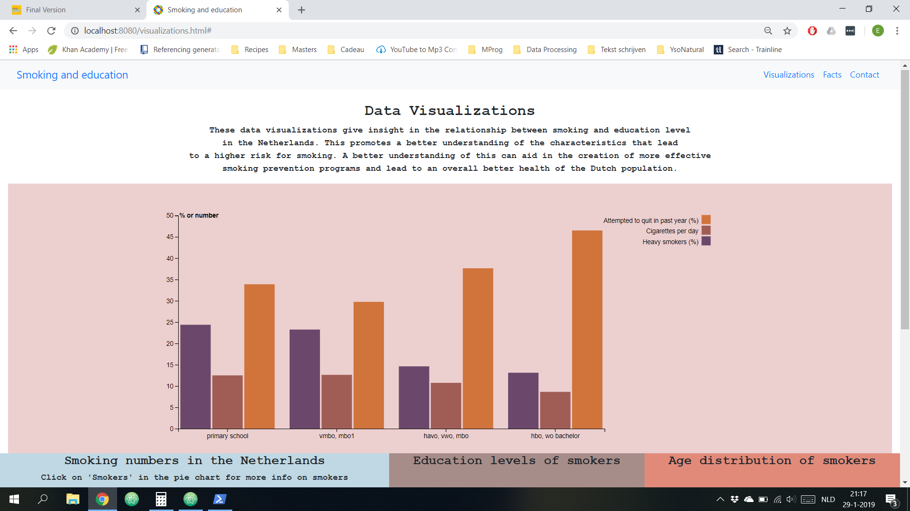

application name, a couple of screen shots (resized to appropriate width/height for readability), its purpose, your name and a copyright statement. The README should be easy to read.

The copyright statement can be either:

a public domain release, which releases your code to the public without any restrictions (you could also use the unlicense for this)

a copyright notice which states who actually owns the rights to the materials in the repository (probably only you)

The README.md should also acknowledge sources of external code, images and other materials that are in the repository but not created by yourself. Make sure that it is clear which directories are copyrighted by different creators.

Also note that these materials have their own respective licenses. You should at the very least note this fact (again, in the README.md). Make sure you also check the licenses to see if you should make a special statement about the source of the materials.

### Intro

This title of this website is 'Smoking and Education'. It's purpose is to make the relationship between smoking and education level more clear. This information can be used by organizations that organize smoking prevention programs. It can also create more awareness among the Dutch population.

