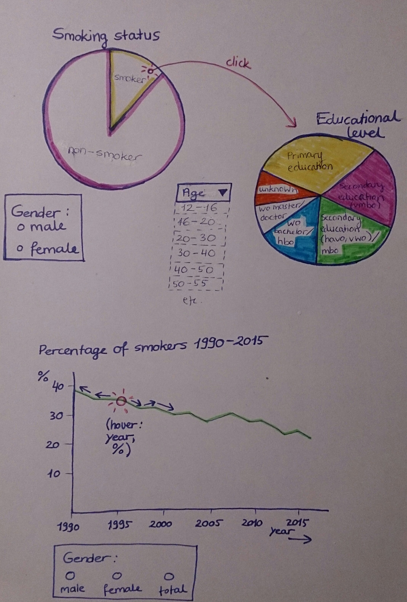
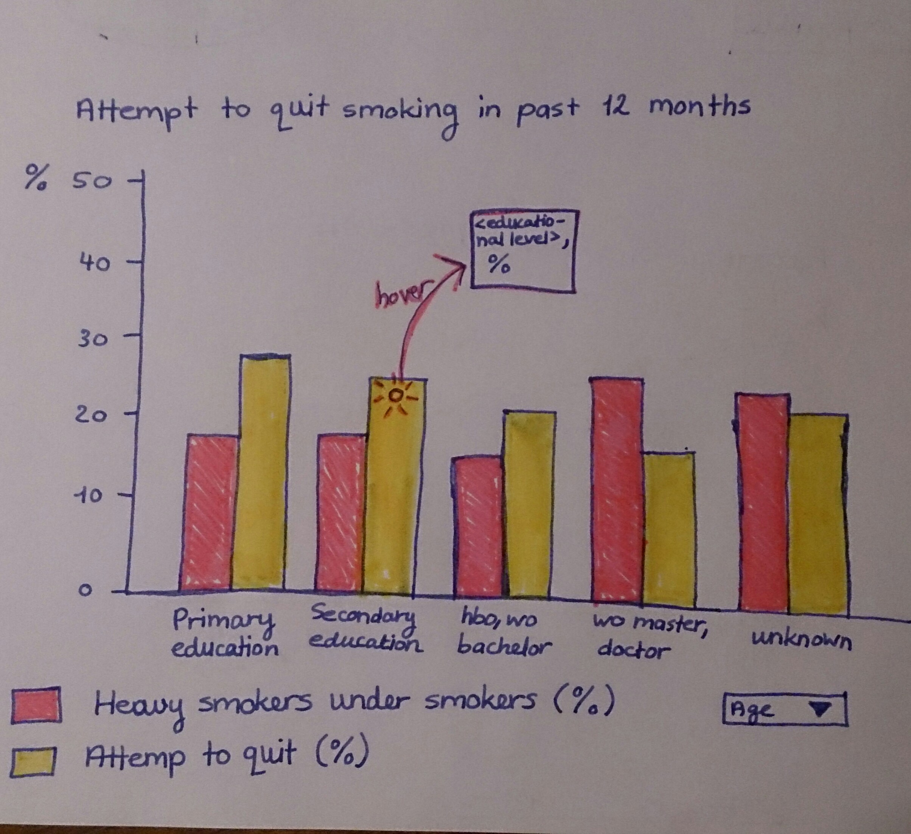

# Project Proposal
#### Ewa Sillem

### Summary goals
The goal of this data visualization project is to create a better view of the relationship between educational level and smoking behavior, in order to reinforce more effective smoking prevention programs.

### Problem statement

Even though the health consequences of smoking are well known in the Nehterlands, over a fifth of the population (12 years or older) is a smoker. It is important to identify the risk factors associated with the likelihood to smoke, so that high-risk groups can be formulated and more effective prevention programs can be implemented. The focus of this project is to make the association between smoking habits and age and educational level more clear and understandable through the use of data visualization. The target audience are public health departments and other organizations that are concerned with public health.

### Solution
The visualisations will create a better view of the relationship between educational level and smoking behavior, making more effective prevention programs

##### Minimum Viable Product
Main features:
- Pie chart that shows the proportion of the Dutch population that smokes.
    - When clicked on the 'smokers' part of the pie chart, another pie chart shows how the smokers are spread over different educational levels.
    - Both pie charts can be filtered by gender (male or female).
- A line graph will represent the trend of smokers in the Dutch population over the last 2,5 decades.
    - When the mouse hovers over the line, exact information appears of the year and percentage of smokers at that point in the line graph.
    - The line graph can also be filtered by gender (male or female).
- The third and last visualization is a bar chart, representing the percentage of people that are smokers and the percentage of people that have tried to quit smoking in the past 12 months, classified by educational level.
    - The user can filter the information in the bar chart by age categories.

##### Optional implementations
- Perhaps a graph with more information about the costs of smoking and/or the health complications of smoking. A suited dataset for these implementations has yet to be found.

### Prerequisites
##### Links to datasets:
1. https://opendata.cbs.nl/statline/#/CBS/nl/dataset/83021NED/table?dl=F05B
2. https://www.volksgezondheidenzorg.info/onderwerp/roken/cijfers-context/trends

##### Similar data visualizations
The link to the following data visualization is what I would like to make. All my visualizations will be based on this concept of being able to hover over the graph and get more information about the graph via a pop-up (not sure if this is the right term?):
https://www.volksgezondheidenzorg.info/onderwerp/alcoholverslaving/cijfers-context/sterfte#node-sterfte-alcoholverslaving-naar-leeftijd-en-geslacht

I liked this example of one of the projects of recent years. I would like to make a similar pie chart where its possible to filter the analyzed group by certain factors such as gender.   
https://jaspernaberman.github.io/Programming-Project/Scripts/HTML/index.html

##### External components
At the moment, this part of the proposal is difficult to formulate due to my personal lack of experience and knowledge of data visualization libraries. I can only assume that I will be needing libraries such as D3, panda and csv in order to get the data that I want to use and create the visualizations that I have in mind.

##### Hardest parts
The hardest parts will be figuring out how the different libraries work and getting more confidence in programming the data visualizations.
