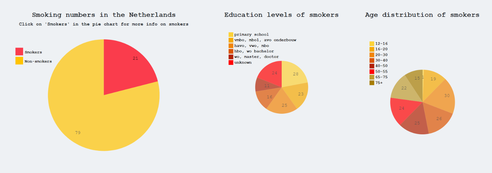

a copyright notice which states who actually owns the rights to the materials in the repository (probably only you)

The README.md should also acknowledge sources of external code, images and other materials that are in the repository but not created by yourself. Make sure that it is clear which directories are copyrighted by different creators.

Also note that these materials have their own respective licenses. You should at the very least note this fact (again, in the README.md). Make sure you also check the licenses to see if you should make a special statement about the source of the materials.

## Ewa Sillem
 https://ewasilly.github.io/ProjectMProg/
 © 2019 - 2019 Ewa Sillem - All Rights Reserved.

### Intro
The title of this website is 'Smoking and Education'. It's purpose is to make the relationship between smoking and education level more clear. This information can be used by organizations that organize smoking prevention programs. It can also create more awareness among the Dutch population.

The home page:

### Visualizations
From the home screen, the user can navigate to the tab "Visualizations". On that page visualizations are shown with a bar chart at the top of the page, under it the three pie chart, and at the bottom the line graph.

The following screenshot shows the bar chart. It's purpose is to visualize a variety of characteristics that smokers have and the extent to which those characteristics apply to smokers at different education levels.

Following the bar chart are the pie charts. At first, only one pie chart is visible. This pie chart represents the distribution of smokers and non-smokers among the Dutch population. It is possible to click on the "Smoker" part of the pie chart. Once clicked, the other two pie charts and the line graph appear.

The middle pie chart represents the distribution of education levels, and the third pie chart represents the age distribution among smokers.

This line graph shows the trend of smoking behavior over the years 1990-2017. This information can be found for all smokers in the Netherlands, female smokers and male smokers.  

### Facts
The "Facts" page contains a couple of facts about smoking. This page is supposed to give a clear picture of the seriousness of smoking and the detrimental effects it has on health on a global scale.

### Contact
This page is quite straightforward in its purpose. It gives some contact information of the person who made the website.

### External sources

#### Facts page
I used information from the website of the organization Centers for Disease Control and Prevention:  https://www.cdc.gov/tobacco/data_statistics/fact_sheets/fast_facts/index.htm

#### Visualizations
Source of bar chart: https://bl.ocks.org/Andrew-Reid/64a6c1892d1893009d2b99b8abee75a7

Source of line graph:
https://codepen.io/zakariachowdhury/pen/JEmjwq
