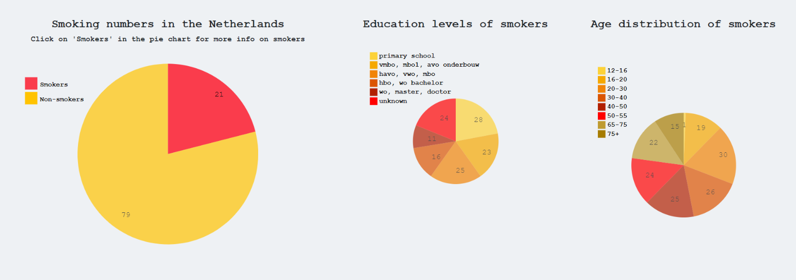

# Final Report

## Short Description
The website goal of 'Smoking and Education' is to give a better understanding of the association between smoking and education level. This can in turn create awareness among the Dutch population, and it can help organizations that organize smoking prevention programs to improve the programs.

## Technical design
#### Global
- Downloading of files and parsing
- Starting with code for pie charts
- Then start with the line graph
- Then make the bar chart
- Once all components are made, focus on the linked views (click on "Smokers" in pie chart 1 creates 2 other pie charts and a line graph)
- Make the dropdown menu for the line graph
- Work on the aesthetics of the website

#### Detail:
- I downloaded 2 csv files (data_pie_bar.csv and data_line.csv) from my sources and converted them into json files. For the bar chart I only needed to filter the file data_pie_bar.csv (I did this manually as it was just a minute of work). The bar chart used a csv file as input, and the line graph and pie charts used json files as input.

- Once the data was ready I started writing the function 'pie'. It is called in main when the page is loaded. It creates an svg to which the pie chart will be appended. An id is also added to the first pie, so that it can be referenced to later in the code. This is necessary for the positioning of the pie chart with bootstrap. A legend is also added to svg. The legend consists of blocks and text. The function 'pie' takes three parameters which should be three datasets. The first dataset is for the first pie chart, the second dataset is for the second pie chart (function pie2) and the third dataset is for the third pie chart (function pie3). When the first pie chart is clicked on, the functions of the second and third pie chart get called. The first pie chart needs those other two datasets to pass on as arguments to the second and third pie chart.

- Once the "Smokers" part of the first pie chart is clicked on, function 'pie2' and 'pie3' are called. Each of those functions take one parameter, their own dataset. Each function creates its own svg to which the pie chart will be appended, and they also have their own legend with block and text.

- The third function that is called when clicked on .arc of function 'pie' is the function 'line'. 'line' takes only one parameter, which is the necessary data to create the lines with. The dataset contains data for three seperate lines, one line for women and men, a second line only for men and a third line only for women. When 'line' is called, only the 'Total' line appears (so the line that represents men and women). A dropdown menu is made in the html of the current page. If the user clicks on one of the options in the dropdown menu, function 'add_lines' is called. The html page passes on argument x to the add_lines function. x can hold the value 'Mannen', 'Vrouwen', or 'Totaal', depending on which option was clicked on in the dropdown menu. 'add_lines' doesn't know which data to use yet, so the first thing that has to be done in the function is to load the data with d3.json. Now the function knows what to work with. Local variables are defined for width, height, scales etc. After that the function 'update' is defined (which is nested in 'add_lines') and called upon with a selection of the original. The selection is made on basis of the x which has been passed on at the beginning of add_lines, so the selection will give the data for men, women or total. Now 'update' can finally add the wanted lines into the already existing svg.

- The bar chart was made using a csv file. The function 'bar' is called directly when the page is loaded in main.js. An svg is created which the bar chart will be plotted onto. Local variables such as width, height and margin are defined. After that the data is loaded with d3.csv. At first, all the rectangles of bar chart are created and the legend is created with block and text. The blocks in legend have an .on("click") function, which calls the function 'update'. The function 'update' is a nested function in 'bar'. It takes d as a parameter. d is in this case the text that belongs to the ticked block in the legend. The function then readjusts the new bars in the chart with a transition. A list named 'filtered' is used to keep track of which options in the legend are already showing in the chart and which aren't. That way the function knows whether to add or remove bars.

- Every js or html file has its own css file. The css files are used to change text-sizes, text-fonts, text-weight and other rather basic aesthetic adjustments.

- Bootstrap is used in the html files to make order in the position of the data visualizations. All the visualizations in the visualizations.html are together in one container-fluid. The bar chart is in its own column. Under that column I created a row with three columns in it, one for each pie chart. Under that row I created another row the line graph in the left column (right-aligned) and the dropdown menu in the right columns (left-aligned).

## Experienced challenges
- The grouped bar chart, I had to start all over in week 3 because my bar chart turned out to be a normal bar chart and not a grouped bar chart.
- The dropdown many was quite tricky for me. I made the line graph first with all the lines in it, and then applied the dropdown menu. It took me some time to figure out how to isolate one line and make the 'add_lines' function work.
- Errors don't always show up, so it's sometimes hard to figure out what is going wrong.
- I had to learn how to stay calm when many errors appeared
- I didn't really understand how data was loaded onto the page at first
- I still find correct use of functions rather difficult

## Changes I have made
- I had to let some ideas go because of a lack of time. For example, I wanted my line graph and pie chart to have a pretty transition, instead of just appearing on the page. Although I'm happy with the result, I would have liked to make my website look a bit more professional.
- I also wanted to add tooltips to my bar chart, but I didn't want to risk messing up my work in the last day before the deadline.
- Another thing that I had to let go of was that the last data point on the right of the line graph and the '7' in '2017' on the x-axis was partly cut off. I was able to fix this by making the svg bigger in the console, but when I tried to change this in my code nothing happened. I decided to leave it as it was due to little time left.
- I had to write the grouped bar chart in d3 version 4, because it was taking me too long to translate the example which was in version 4 to version 5.

## Decisions
Overall I am quite happy with my final result. I think it looks a lot like what I envisioned at first. I did not have to scratch a lot of ideas from my initial proposal, because I purposefully made a proposal which I thought would be realistic for myself to accomplish. Not that it was easy!!! I definitely challenged myself and learned a lot. In the week before the deadline we had to start thinking about what we wanted to keep and what we needed to let go. I still had to make a grouped bar chart and a working dropdown menu, which I had both never done before. I focused on getting those things working, and not thinking to much about the looks of the whole page. Once all the visualizations were working, I had 1 more day to work on perfecting the look of my website. I could have also used this time to add more tooltips, but I thought it would be too big of a risk (I might mess up my code) and I figured that the look of the website as a whole was more important at this point.

I also decided to use d3 v4 for the bar chart. The reason for this is that the example that I took from blocks was written in version 4, and I had spent 1,5 days on unsuccessfully trying to translate the code to version 5. I was freaking out and then a friend told me that it was allowed to use two different versions of d3 in one html page, so I started googling that. I managed to make both versions work on one html page, which is not perfect but it did the trick and everything works now!

## In an ideal world...
If I would have been given more time I would have definitely done the transitions of the pie chart and line graph and added some cool effects. I would also add more linked views to the two smaller pie charts, maybe I could find some more information on those specific topics. A sunburst would also be nice. I didn't dare to try that for this project, but I would definitely like to try making that in the future. I would also try to translate the version 4 code of the grouped bar chart into version 5.
